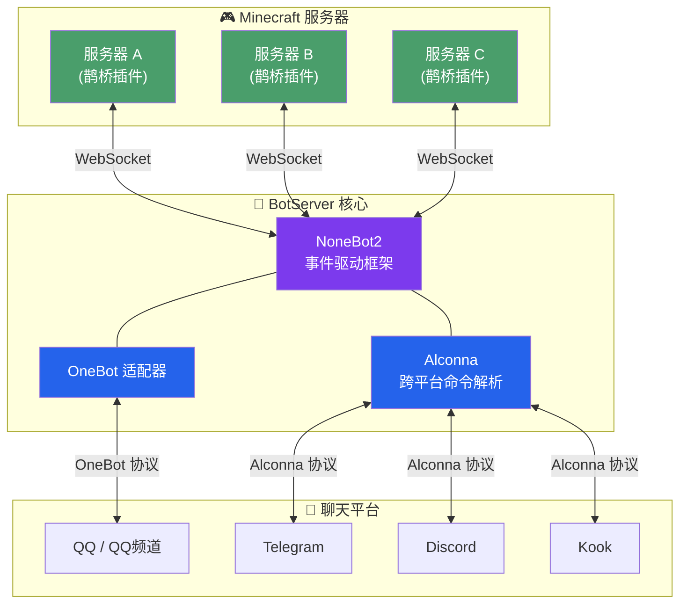

<p align="center">
  
  
  
  
  
</p>

<h1 align="center">🧊 Minecraft QQ Bot</h1>

<p align="center">
  <b>跨平台 · 多服互联 · 即插即用 — 让 Minecraft 与你的聊天世界无缝相连</b>
</p>

<p align="center">
  <a href="https://mcbot.ytb.icu/">📖 文档</a>
  ·
  <a href="https://qm.qq.com/q/B3kmvJl2xO">💬 加入 QQ 群</a>
  ·
  <a href="https://github.com/Minecraft-QQBot/BotServer/issues">🐛 反馈问题</a>
</p>

---

## ✨ 亮点速览

| 特性 | 说明 |
|------|------|
| **🌐 真正的跨平台** | 不止 QQ，还支持 Telegram、Discord、Kook、QQ 频道等，一套指令全平台通用 |
| **🔗 多服互联** | 同时连接多台 Minecraft 服务器，消息互通，跨服聊天零延迟 |
| **⚡ WebSocket 实时通信** | 基于 [nonebot-adapter-minecraft](https://github.com/17TheWord/nonebot-adapter-minecraft) 的 WebSocket 长连接，告别轮询，消息即时送达 |
| **🧩 模块化架构** | 指令按插件拆分，Alconna 命令解析器驱动，扩展新功能就像搭积木 |
| **🤖 AI 智能对话** | 接入任意 OpenAI 兼容 API，@机器人即可与 AI 对话，支持上下文记忆 |
| **🔐 白名单管理** | 完善的 QQ 与游戏 ID 绑定系统，支持多服白名单同步 |
| **🎨 图片渲染模式** | 基于 HTML + CSS 模板引擎，将指令输出渲染为精美图片，支持自定义背景 |
| **🐳 Docker 支持** | 一键部署，开箱即用 |

---

## 📖 使用方法

### 前置要求

- Python 3.10 ~ 3.12
- [UV](https://docs.astral.sh/uv/)（推荐，快速包管理器）或 pip
- Minecraft Java 服务端（需安装 [鹊桥插件](https://github.com/17TheWord/MC_QQ_Spigot)）
- 一个 QQ 机器人账号（或其他平台账号）

### 🚀 快速安装与启动

#### 方式一：使用 UV（推荐）

```bash
# 克隆项目
git clone https://github.com/Minecraft-QQBot/BotServer
cd BotServer

# 创建虚拟环境并安装依赖（UV 自动管理）
uv sync

# 如需启用图片渲染模式，额外安装 image 依赖
uv sync --extra image

# 复制环境配置模板
cp .env.example .env

# 编辑 .env 配置文件（按需修改）
# vim .env

# 启动机器人
uv run nb run
```

> **为什么推荐 UV？** UV 比 pip 快 10-100 倍，自动解析依赖冲突，一条命令即可完成虚拟环境创建与依赖安装。

#### 方式二：使用 pip + venv（传统方式）

```bash
git clone https://github.com/Minecraft-QQBot/BotServer
cd BotServer

# 创建虚拟环境
python3 -m venv .venv
source .venv/bin/activate

# 安装依赖
pip install -e .

# 如需启用图片渲染模式，额外安装 image 依赖
pip install -e ".[image]"

# 配置环境
cp .env.example .env
# vim .env

# 启动
nb run
```

### ⚙️ 配置说明

创建 `.env` 文件后，至少需要配置以下关键项：

```ini
# 管理员 QQ 号列表
SUPERUSERS=["123456789"]

# 推送消息的群组（支持多群）
MESSAGE_GROUPS=["qq:123456789"]

# Minecraft 服务器 WebSocket 地址（支持多服）
MINECRAFT_WS_URLS={"server1": ["ws://你的IP:端口/路径"]}

…………
```

> 📖 完整配置项说明请参阅 `.env` 文件内注释。

### 🐳 Docker 部署

```bash
git clone https://github.com/Minecraft-QQBot/BotServer
cd BotServer
# 编辑 .env 配置文件
docker compose up -d
```

---

## 🎯 功能一览

### 群服互通

- ✅ 游戏内实时看到 QQ 群消息
- ✅ QQ 群内看到游戏内聊天，支持文字、图片等消息类型
- ✅ 玩家 **加入 / 离开 / 死亡** 全事件播报
- ✅ 服务器 **开启 / 关闭** 自动通知
- ✅ 多服消息互转，构建你的分布式 MC 网络

### 指令系统

| 指令 | 功能 |
|------|------|
| `/list` | 查询所有服务器的在线玩家 |
| `/server` | 查看当前连接的服务器列表 |
| `/luck` | 每日运势占卜（仅供娱乐） |
| `/send` | 向游戏内发送消息 |
| `/command` | 远程执行 Minecraft 指令（管理员） |
| `/bound` | 绑定 / 解绑 / 查询游戏白名单 |
| `/help` | 查看命令帮助 |
| `/about` | 关于本机器人 |

> 💡 所有指令均基于 [Alconna](https://github.com/ArcletProject/Alconna) 解析，跨平台表现一致。

### 🎨 图片渲染模式

启用 `IMAGE_MODE` 后，机器人的指令输出将以 **图片** 形式发送，而非纯文本。渲染引擎基于 HTML + CSS 模板（Jinja2 + html2pic），效果美观且高度可定制。

**支持图片渲染的指令：**

| 指令 | 渲染内容 |
|------|----------|
| `/list` | 在线玩家列表（含玩家头像） |
| `/server` | 服务器连接状态 |
| `/luck` | 每日运势卡片 |
| `/bound` | 白名单绑定信息 |
| `/help` | 帮助信息 |
| `/about` | 关于页面 |

**自定义背景：**

通过 `IMAGE_BACKGROUND` 配置项设置图片背景，值为 CSS `background-image` 属性值：

```ini
# 使用本地图片
IMAGE_BACKGROUND=url("./Resources/Backgrounds/dirt.png")

# 使用渐变色
IMAGE_BACKGROUND=linear-gradient(150deg, #2e4a30 0%, #1d3524 55%, #12241a 100%)
```

> ⚠️ 图片模式会略微增加响应时间（需渲染 HTML 并转换为图片）。模板文件位于 `Resources/Images/` 目录，可自行修改 HTML/CSS 定制样式。

### 智能扩展

- **🤖 AI 对话**：@机器人即可聊天，支持自定义 API 地址、模型和系统提示词，对话上下文自动管理
- **🔑 关键词回复**：自定义关键词自动触发回复，无需编程

### 灵活配置

- 按需启停指令模块
- 自定义消息格式与颜色
- 敏感词过滤
- 兼容模式支持
- API 接口开放（可选）

---

## 🏗️ 架构设计

```
BotServer
├── nonebot2 核心                    ← 异步事件驱动框架
├── nonebot-adapter-onebot          ← QQ 平台接入
├── nonebot-adapter-minecraft       ← Minecraft WebSocket 通信
├── nonebot-plugin-alconna          ← 跨平台命令解析
├── nonebot-plugin-uninfo           ← 统一会话信息
├── Plugins/
│   ├── Commands/                   ← 独立指令模块
│   │   ├── About.py                ← 关于信息
│   │   ├── Bound.py                ← 白名单绑定
│   │   ├── Command.py              ← 远程指令执行
│   │   ├── Help.py                 ← 帮助系统
│   │   ├── List.py                 ← 在线玩家查询
│   │   ├── Luck.py                 ← 每日运势
│   │   ├── Send.py                 ← 消息发送
│   │   └── Server.py               ← 服务器状态
│   ├── Events.py                   ← MC 事件处理中枢
│   └── Expand/
│       ├── Ai.py                   ← AI 智能对话
│       └── Keywords.py             ← 关键词自动回复
└── Scripts/
    ├── Managers/
    │   ├── Data.py                 ← 数据持久化
    │   ├── Server.py               ← 服务器连接管理
    │   ├── Environment.py          ← 环境管理
    │   └── Version.py              ← 版本管理
    ├── Config.py                   ← 配置模型定义
    ├── Network.py                  ← 网络请求工具
    ├── Utils.py                    ← 工具函数
    └── Render.py                   ← 图片渲染引擎
```

### 通信流程



> Minecraft 服务端需安装 [鹊桥（QueQiao）](https://github.com/17TheWord/MC_QQ_Spigot) 插件/模组来建立连接。

---

## 🚀 快速开始

### 前置要求

- Python 3.10 ~ 3.12
- 一个 Minecraft Java 服务端（需安装鹊桥插件）
- 一个 QQ 机器人账号（或其他平台账号）

### 1️⃣ 克隆项目

```bash
git clone https://github.com/Minecraft-QQBot/BotServer
cd BotServer
```

### 2️⃣ 安装依赖

```bash
pip install -e .
```

> 推荐使用 [uv](https://docs.astral.sh/uv/) 或 venv 创建虚拟环境。

### 3️⃣ 配置环境

复制 `.env.example` 为 `.env`，按需修改：

```ini
SUPERUSERS=["你的QQ号"]

# QQ 群列表
MESSAGE_GROUPS=["qq:123456789"]

# Minecraft 服务器 WebSocket 地址
MINECRAFT_WS_URLS={"server1": ["ws://你的服务器IP:端口/路径"]}

# 可选：AI 对话
AI_ENABLED=true
AI_API_KEY="sk-xxxx"
AI_BASE_URL="https://api.openai.com/v1"
```

### 4️⃣ 安装鹊桥插件

在 Minecraft 服务端安装 [鹊桥（QueQiao）](https://github.com/17TheWord/MC_QQ_Spigot)，配置连接地址指向机器人。

### 5️⃣ 启动！

```bash
nb run
```

---

## 🐳 Docker 部署

### Docker Compose（推荐）

```bash
git clone https://github.com/Minecraft-QQBot/BotServer
cd BotServer
# 编辑 .env 配置文件
docker compose up -d
```

### 自行构建

```bash
docker build -t minecraft-qqbot .
docker run -d \
  --name minecraft-qqbot \
  -p 8000:8000 \
  -v $(pwd)/.env:/app/.env \
  -v $(pwd)/data:/app/data \
  -v $(pwd)/Logs:/app/Logs \
  --restart unless-stopped \
  minecraft-qqbot
```

---

## ⚙️ 配置参考

### 核心配置

| 配置项 | 说明 | 默认值 |
|--------|------|--------|
| `SUPERUSERS` | 管理员 QQ 号列表 | `[]` |
| `MESSAGE_GROUPS` | 消息推送的群组列表 | `[]` |
| `MINECRAFT_WS_URLS` | Minecraft 服务器 WebSocket 地址 | `{}` |
| `COMMAND_START` | 指令前缀 | `["."]` |
| `COMMAND_ENABLED` | 启用的指令列表 | `[]`（默认全部启用） |

### 图片渲染

| 配置项 | 说明 | 默认值 |
|--------|------|--------|
| `IMAGE_MODE` | 是否启用图片渲染模式 | `false` |
| `IMAGE_BACKGROUND` | 图片背景（CSS background-image 值） | 渐变色 |

### 消息同步

| 配置项 | 说明 | 默认值 |
|--------|------|--------|
| `BROADCAST_SERVER` | 播报服务器启停 | `true` |
| `BROADCAST_PLAYER` | 播报玩家进出/死亡 | `true` |
| `SYNC_ALL_QQ_MESSAGE` | 同步所有 QQ 群消息到游戏 | `true` |
| `SYNC_MESSAGE_BETWEEN_SERVERS` | 服务器间消息互转 | `true` |
| `SYNC_SENSITIVE_WORDS` | 敏感词过滤列表 | `[]` |

### 更多配置

> 📖 完整配置项请参阅 [在线文档](https://mcbot.ytb.icu/)

---

## 📸 截图预览

| QQ 群内 | 游戏内 |
|---------|--------|
| 查看在线玩家 | 收到 QQ 群消息 |
| AI 智能对话 | 玩家进出通知 |
| 每日运势 | 跨服消息广播 |

> 更多截图请访问 [项目文档](https://mcbot.ytb.icu/)

---

## 🧪 对比同类方案

| 特性 | **Minecraft QQ Bot** | 传统方案 |
|------|---------------------|---------|
| 多平台支持 | ✅ QQ / Telegram / Discord / Kook… | ❌ 通常仅 QQ |
| 多服互联 | ✅ 原生支持，消息互转 | ❌ 需自行改装 |
| WebSocket 通信 | ✅ 实时长连接 | ⚠️ 多为 HTTP 轮询 |
| 模块化插件 | ✅ 指令即插即用 | ❌ 单体耦合 |
| AI 集成 | ✅ 开箱即用 | ❌ 需自行对接 |
| Docker 部署 | ✅ 一键启动 | ⚠️ 视项目而定 |
| 白名单管理 | ✅ 完善的绑定系统 | ❌ 无或基础 |

---

## 🤝 贡献指南

欢迎任何形式的贡献！无论是 Bug 报告、功能建议还是代码提交：

1. **提交 Issue**：报告 Bug 或提出新功能建议
2. **Pull Request**：Fork 项目，创建特性分支，提交 PR
3. **加入讨论**：加入 [QQ 群 `962802248`](https://qm.qq.com/q/B3kmvJl2xO)

> [!WARNING]
> 本项目采用 **GPL-3.0** 许可证。修改后的代码必须开源并注明出处，**禁止商用**。

---

## 🙏 致谢

- [NoneBot2](https://nonebot.dev/) — 高效优雅的异步机器人框架
- [nonebot-adapter-minecraft](https://github.com/17TheWord/nonebot-adapter-minecraft) — Minecraft 协议适配
- [Alconna](https://github.com/ArcletProject/Alconna) — 强大的命令解析库
- 感谢以下伙伴的贡献与支持：
  - [Msg_Lbo](https://github.com/Msg-Lbo) — 网站服务器与域名支持
  - [meng877](https://github.com/meng877) — 意见与代码贡献
  - [Decent_Kook](https://github.com/AISophon) — 测试环境与宣传
  - [creepebucket](https://github.com/creepebucket) — 测试环境

---

## 🔗 友情链接

- [TQM 服务器](https://tqm.mc/)
- [LemonFate 服务器](https://www.lemonfate.cn/)
- [RedstoneDaily 红石日报](https://www.redstonedaily.com/)

---

<p align="center">
  Made with ❤️ by Minecraft-QQBot Team
</p>
