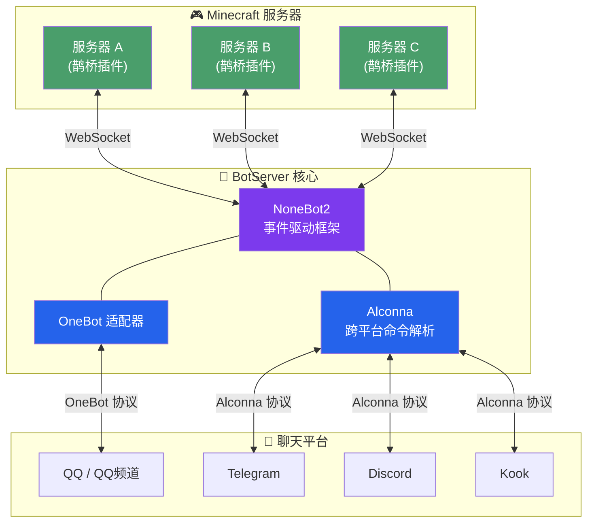

<p align="center">
  
  
  
  
  
</p>

<h1 align="center">🧊 Minecraft UniBot</h1>

<p align="center">
  <b>跨平台 · 多服互联 · 即插即用 — 让 Minecraft 与你的聊天世界无缝相连</b>
</p>

<p align="center">
  <a href="https://mcbot.ytb.icu/">📖 文档</a>
  ·
  <a href="https://qm.qq.com/q/B3kmvJl2xO">💬 加入 QQ 群</a>
  ·
  <a href="https://github.com/Minecraft-QQBot/BotServer/issues">🐛 反馈问题</a>
</p>

---

## ✨ 亮点速览

| 特性 | 说明 |
|------|------|
| **🌐 真正的跨平台** | 不止 QQ，还支持 Telegram、Discord、Kook、QQ 频道等，一套指令全平台通用 |
| **🔗 多服互联** | 同时连接多台 Minecraft 服务器，消息互通，跨服聊天零延迟 |
| **⚡ WebSocket 实时通信** | 基于 [nonebot-adapter-minecraft](https://github.com/17TheWord/nonebot-adapter-minecraft) 的 WebSocket 长连接，告别轮询，消息即时送达 |
| **🧩 模块化架构** | 指令按插件拆分，Alconna 命令解析器驱动，扩展新功能就像搭积木 |
| **🖥️ WebUI 管理面板** | 基于 Vue 3 构建的现代化管理界面，可视化配置、实时监控、日志查看，开箱即用 |
| **🤖 AI 智能对话** | 接入任意 OpenAI 兼容 API，@机器人即可与 AI 对话，支持上下文记忆 |
| **🔐 白名单管理** | 完善的 QQ 与游戏 ID 绑定系统，支持多服白名单同步 |
| **🎨 图片渲染模式** | 基于 HTML + CSS 模板引擎，将指令输出渲染为精美图片，支持自定义背景 |
<!-- | **🐳 Docker 支持** | 一键部署，开箱即用 | -->

---

## 📖 快速开始

### 前置要求

- Python 3.11+
- [UV](https://docs.astral.sh/uv/)（推荐，快速包管理器）或 pip
- Minecraft Java 服务端（需安装 [鹊桥插件](https://github.com/17TheWord/MC_QQ_Spigot)）
- 一个 QQ 机器人账号（或其他平台账号）

### 🚀 安装与启动

#### 方式一：一键脚本安装（推荐）

从 [Releases 页面](https://github.com/Minecraft-QQBot/BotServer/releases) 下载对应平台的一键安装脚本：

| 平台 | 脚本 |
|------|------|
| **Windows** | `Install.bat` — 双击运行，自动安装 uv、克隆仓库、配置 WebUI 并同步依赖 |
| **Linux / macOS** | `Install.sh` — `chmod +x Install.sh && ./Install.sh`，一键完成所有部署步骤 |

脚本会自动完成以下操作：
1. 检测并安装 [UV](https://docs.astral.sh/uv/) 包管理器
2. 克隆 UniBot 仓库
3. 询问是否启用 WebUI（选择 `y` 自动开启并安装额外依赖）
4. 执行 `uv sync` 同步所有依赖

> 💡 一键脚本适合快速部署，如需自定义配置可后续编辑 `.env` 和 `Config.toml`。

#### 方式二：使用 UV（手动）

```bash
# 克隆项目
git clone https://github.com/Minecraft-QQBot/BotServer
cd BotServer

# 创建虚拟环境并安装依赖（UV 自动管理）
uv sync

# 如需启用图片渲染模式，额外安装 image 依赖
uv sync --extra image

# 如需启用 WebUI 管理面板，额外安装 webui 依赖
uv sync --extra webui

# 编辑配置文件（按需修改）
# .env — NoneBot 框架与适配器配置
# Config.toml — 机器人自定义配置

# 启动机器人
uv run Bot.py
```

> **为什么推荐 UV？**
> UV 比 pip 快 10-100 倍，自动解析依赖冲突，一条命令即可完成虚拟环境创建与依赖安装。
> [官方文档](https://uv.doczh.com/)

#### 方式三：使用 pip + venv（传统方式）

```bash
git clone https://github.com/Minecraft-QQBot/BotServer
cd BotServer

# 创建虚拟环境
python3 -m venv .venv
source .venv/bin/activate

# 安装依赖
pip install -e .

# 如需启用图片渲染模式，额外安装 image 依赖
pip install -e ".[image]"

# 如需启用 WebUI 管理面板，额外安装 webui 依赖
pip install -e ".[webui]"

# 配置环境（编辑 .env 与 Config.toml）

# 启动
python3 Bot.py
```

<!-- ### 🐳 Docker 部署

#### Docker Compose（推荐）

```bash
git clone https://github.com/Minecraft-QQBot/UniBot
cd UniBot
# 编辑 .env 配置文件
docker compose up -d
```

#### 自行构建

```bash
docker build -t minecraft-qqbot .
docker run -d \
  --name minecraft-qqbot \
  -p 8000:8000 \
  -v $(pwd)/.env:/app/.env \
  -v $(pwd)/data:/app/data \
  -v $(pwd)/Logs:/app/Logs \
  --restart unless-stopped \
  minecraft-qqbot
``` -->

### ⚙️ 配置说明

项目采用 **双配置文件** 体系：

| 文件 | 用途 | 格式 |
|------|------|------|
| `.env` | NoneBot 框架配置与适配器配置 | INI 风格 |
| `Config.toml` | 机器人自定义配置（指令、消息同步、图片渲染、AI 等） | TOML |

#### `.env` — 框架与适配器

```ini
# 监听端口与主机
PORT=8000
HOST="127.0.0.1"

# 超级用户（管理员 QQ 号）
SUPERUSERS=["1234567890"]

# 命令起始字符与分隔符
COMMAND_SEP=[" "]
COMMAND_START=["."]

# Minecraft 服务器 WebSocket 地址（支持多服）
MINECRAFT_WS_URLS={"server1": ["ws://127.0.0.1:8080/mc"]}
```

#### `Config.toml` — 自定义配置

```toml
# 连接密钥（公网部署务必设置）
token = ""

# 启用的指令（send 仅在 sync_all_qq_message 为 false 时生效）
command_enabled = ["list", "luck", "server", "help", "bound", "command", "send"]

# 指令响应群 / 消息同步群（格式 "{平台}:{群ID}"）
command_groups = ["qq_client:123456789"]
message_groups = ["qq_client:123456789"]

# 消息同步开关
sync_all_qq_message = true       # 群消息 → 服务器
sync_all_game_message = false    # 服务器消息 → 群
sync_message_between_servers = false  # 服务器之间互转

# 图片渲染模式
[image]
mode = false
background = 'url("./Resources/Backgrounds/dirt.png")'

# AI 对话（OpenAI 兼容 API）
[ai]
enabled = false
base_url = ""
model_name = ""
api_key = ""
system_prompt = "你是一个可爱的小女孩……"

# 关键词自动回复
[auto_reply]
enabled = false
keywords = { "看群公告里的 IP 地址。" = ["服务器在哪", "服务器地址"] }

# API 服务器
[api]
enabled = false
token = ""
```

> 📖 完整配置项说明请参阅 `Config.toml` 与 `.env` 文件内注释。

## 🎯 功能一览

### 群服互通

- ✅ 游戏内实时看到 QQ 群消息
- ✅ QQ 群内看到游戏内聊天，支持文字、图片等消息类型
- ✅ 玩家 **加入 / 离开 / 死亡** 全事件播报
- ✅ 服务器 **开启 / 关闭** 自动通知
- ✅ 多服消息互转，构建你的分布式 MC 网络

### 指令系统

| 指令 | 功能 |
|------|------|
| `.list` | 查询所有服务器的在线玩家 |
| `.server` | 查看当前连接的服务器列表 |
| `.luck` | 每日运势占卜（仅供娱乐） |
| `.send` | 向游戏内发送消息（`sync_all_qq_message` 关闭时可用） |
| `.command` | 远程执行 Minecraft 指令（管理员） |
| `.bound` | 绑定 / 解绑 / 查询游戏白名单 |
| `.help` | 查看命令帮助 |
| `.about` | 关于本机器人 |

> 💡 所有指令均基于 [Alconna](https://github.com/ArcletProject/Alconna) 解析，跨平台表现一致。

### 🎨 图片渲染模式

在 `Config.toml` 中设置 `[image] mode = true` 后，机器人的指令输出将以 **图片** 形式发送，而非纯文本。渲染引擎基于 HTML + CSS 模板（Jinja2 + html2pic），效果美观且高度可定制。

**支持图片渲染的指令：**

| 指令 | 渲染内容 |
|------|----------|
| `.list` | 在线玩家列表（含玩家头像） |
| `.server` | 服务器连接状态 |
| `.luck` | 每日运势卡片 |
| `.bound` | 白名单绑定信息 |
| `.help` | 帮助信息 |
| `.about` | 关于页面 |

**自定义背景：**

在 `Config.toml` 的 `[image]` 下设置 `background`，值为 CSS `background-image` 属性值：

```toml
[image]
# 使用本地图片
background = 'url("./Resources/Backgrounds/dirt.png")'

# 使用渐变色
background = 'linear-gradient(150deg, #2e4a30 0%, #1d3524 55%, #12241a 100%)'
```

> ⚠️ 图片模式会略微增加响应时间（需渲染 HTML 并转换为图片）。模板文件位于 `Resources/Images/` 目录，可自行修改 HTML/CSS 定制样式。

### 🖥️ WebUI 管理面板

UniBot 内置基于 **Vue 3 + Vite** 构建的现代化 Web 管理面板，通过 REST API 与后端交互，让管理机器人变得轻松直观。

**主要功能：**

| 功能 | 说明 |
|------|------|
| **📊 仪表盘** | 实时查看机器人运行状态、内存占用、在线服务器数、绑定玩家数 |
| **⚙️ 配置管理** | 可视化编辑 `Config.toml` 和 `.env` 配置，支持 Schema 校验与分组展示 |
| **📋 服务器管理** | 查看所有连接服务器的状态、在线玩家，远程执行指令 |
| **👥 玩家管理** | 管理白名单绑定关系，查看所有已绑定玩家 |
| **🧩 插件管理** | 查看已加载插件列表及其状态 |
| **📄 日志查看** | 实时滚动查看机器人运行日志，支持分级筛选 |
| **🔐 登录认证** | JWT + 密码认证，保障管理安全 |

**启用方式：**

在 `Config.toml` 中设置：

```toml
[webui]
enabled = true
```

启动机器人后，访问 `http://<你的IP>:<PORT>`（默认 `http://127.0.0.1:8000`）即可打开管理面板。首次登录需在 `Config.toml` 中设置 `[api]` 下的 `token` 和密码。

> ⚠️ WebUI 依赖额外包，请确保已执行 `uv sync --extra webui` 或 `pip install -e ".[webui]"`。

### 智能扩展

- **🤖 AI 对话**：@机器人即可聊天，支持自定义 API 地址、模型和系统提示词，对话上下文自动管理
- **🔑 关键词回复**：自定义关键词自动触发回复，无需编程

### 灵活配置

- 按需启停指令模块（`command_enabled`）
- 自定义消息转发颜色（`sync_color_*`）
- 敏感词过滤（`sync_sensitive_words`）
- 兼容模式支持（`list_compatible_mode`）
- 假人前缀分类（`bot_prefix`）
- 指令黑白名单（`command_minecraft_whitelist` / `command_minecraft_blacklist`）
- 绑定数量限制（`qq_bound_max_number`）
- 服务器信息缓存策略（`server_memory_update_interval` / `server_memory_max_cache`）
- API 接口开放（可选，`[api]`）
- WebUI 管理面板（可选，`[webui]`）

---

## 🏗️ 架构设计

```txt
UniBot
├── nonebot2 核心                    ← 异步事件驱动框架
├── nonebot-adapter-minecraft       ← Minecraft WebSocket 通信
├── nonebot-plugin-alconna          ← 跨平台命令解析
├── nonebot-plugin-uninfo           ← 统一会话信息
├── Plugins/
│   ├── Commands/                   ← 独立指令模块
│   │   ├── About.py                ← 关于信息
│   │   ├── Bound.py                ← 白名单绑定
│   │   ├── Command.py              ← 远程指令执行
│   │   ├── Help.py                 ← 帮助系统
│   │   ├── List.py                 ← 在线玩家查询
│   │   ├── Luck.py                 ← 每日运势
│   │   ├── Send.py                 ← 消息发送
│   │   └── Server.py               ← 服务器状态
│   ├── Events.py                   ← MC 事件处理中枢
│   └── Expand/
│       ├── Ai.py                   ← AI 智能对话
│       └── Keywords.py             ← 关键词自动回复
├── Scripts/
│   ├── Managers/
│   │   ├── Data.py                 ← 数据持久化
│   │   ├── Server.py               ← 服务器连接管理
│   │   ├── Environment.py          ← 环境管理
│   │   └── Version.py              ← 版本管理
│   ├── Api/                        ← REST API 路由
│   │   ├── Auth.py                 ← 登录认证
│   │   ├── Config.py               ← 配置管理
│   │   ├── Players.py              ← 玩家管理
│   │   ├── Servers.py              ← 服务器管理
│   │   ├── Plugins.py              ← 插件管理
│   │   ├── Logs.py                 ← 日志查看
│   │   ├── Status.py               ← 状态监控
│   │   ├── Users.py                ← 用户管理
│   │   ├── Ws.py                   ← WebSocket 推送
│   │   └── Schemas.py              ← 数据模型与校验
│   ├── Config.py                   ← 配置模型定义
│   ├── Network.py                  ← 网络请求工具
│   ├── Utils.py                    ← 工具函数
│   └── Render.py                   ← 图片渲染引擎
└── WebUi/                          ← Vue 3 管理面板前端
    ├── src/
    │   ├── views/                  ← 各功能页面
    │   ├── stores/                 ← Pinia 状态管理
    │   ├── router/                 ← 路由配置
    │   ├── utils/                  ← 工具函数
    │   └── composables/            ← 组合式 API
    └── assets/                     ← 静态资源
```

### 通信流程



> Minecraft 服务端需安装 [鹊桥（QueQiao）](https://github.com/17TheWord/MC_QQ_Spigot) 插件/模组来建立连接。

## 🧪 对比同类方案

| 特性 | **Minecraft QQ Bot** | 传统方案 |
|------|---------------------|---------|
| 多平台支持 | ✅ QQ / Telegram / Discord / Kook… | ❌ 通常仅 QQ |
| 多服互联 | ✅ 原生支持，消息互转 | ❌ 需自行改装 |
| WebSocket 通信 | ✅ 实时长连接 | ⚠️ 多为 HTTP 轮询 |
| 模块化插件 | ✅ 指令即插即用 | ❌ 单体耦合 |
| AI 集成 | ✅ 开箱即用 | ❌ 需自行对接 |
| 🖥️ WebUI | ✅ Vue 3 管理面板，开箱即用 | ❌ 无 |
| 🎨 图片渲染 | ✅ HTML/CSS 模板引擎 | ❌ 无 |
| 白名单管理 | ✅ 完善的绑定系统 | ❌ 无或基础 |

---

## 🤝 贡献指南

欢迎任何形式的贡献！无论是 Bug 报告、功能建议还是代码提交：

1. **提交 Issue**：报告 Bug 或提出新功能建议
2. **Pull Request**：Fork 项目，创建特性分支，提交 PR
3. **加入讨论**：加入 [QQ 群 `962802248`](https://qm.qq.com/q/B3kmvJl2xO)

> [!WARNING]
> 本项目采用 **GPL-3.0** 许可证。修改后的代码必须开源并注明出处，**禁止商用**。

---

## 🙏 致谢

- [NoneBot2](https://nonebot.dev/) — 高效优雅的异步机器人框架
- [nonebot-adapter-minecraft](https://github.com/17TheWord/nonebot-adapter-minecraft) — Minecraft 协议适配
- [Alconna](https://github.com/ArcletProject/Alconna) — 强大的命令解析库
- 感谢以下伙伴的贡献与支持：
  - [Msg_Lbo](https://github.com/Msg-Lbo) — 网站服务器与域名支持
  - [meng877](https://github.com/meng877) — 意见与代码贡献
  - [Decent_Kook](https://github.com/AISophon) — 测试环境与宣传
  - [creepebucket](https://github.com/creepebucket) — 测试环境

---

## 🔗 友情链接

- [TQM 服务器](https://tqm.mc/)
- [LemonFate 服务器](https://www.lemonfate.cn/)
- [RedstoneDaily 红石日报](https://www.redstonedaily.com/)

---

<p align="center">
  Made with ❤️ by LonelySail
</p>
